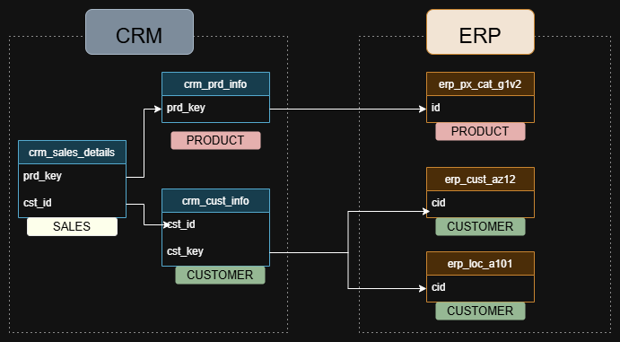
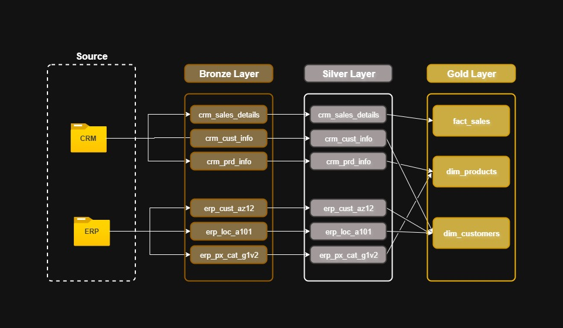

# Sales and Customer Data Warehouse - Medallion Architecture 🚀🚀
## Overview 📑
This project builds a modern data warehouse using SQL Server and follows the medallion architecture. Data from CRM and ERP CSVs are ingested into the Bronze layer, cleaned and transformed in the Silver layer, and structured in Gold layer views for analytics and reporting.
It involves 
- Data Architecture: Creating a Data warehouse using Medallion Architecture
- ETL Pipelines: Extracting, transforming, and loading data from the source systems into the warehouse using stored procedures
- Data Modeling: Developing fact and dimensional tables using VIEWS and modeling them in a star schema

## ETL Pipeline Overview ⚙️
### Bronze Layer - Raw Ingestion
The following figure explains the data from the two systems and how they integrate

In the bronze layer
- Loaded full CRM and ERP CSV datasets directly into tables.
- No transformations applied at this stage to preserve data fidelity.

### Silver Layer – Data Cleaning & Standardization
Applied core ETL transformations while keeping the original table structure intact:
- Deduplication using ROW_NUMBER() to retain the most recent record per entity.
- String cleaning- trimming whitespace and normalizing case.
- Category standardization (e.g., converting single-letter gender/marital codes to readable values).
- Handling missing and null values using default values or conditional logic.
- Data quality assurance by filtering invalid IDs and inconsistent records.

These transformations were encapsulated in a Silver layer stored procedure for consistent, auditable processing.

## ETL/Data Transformation

## Data Sources
## Future Improvemnts
