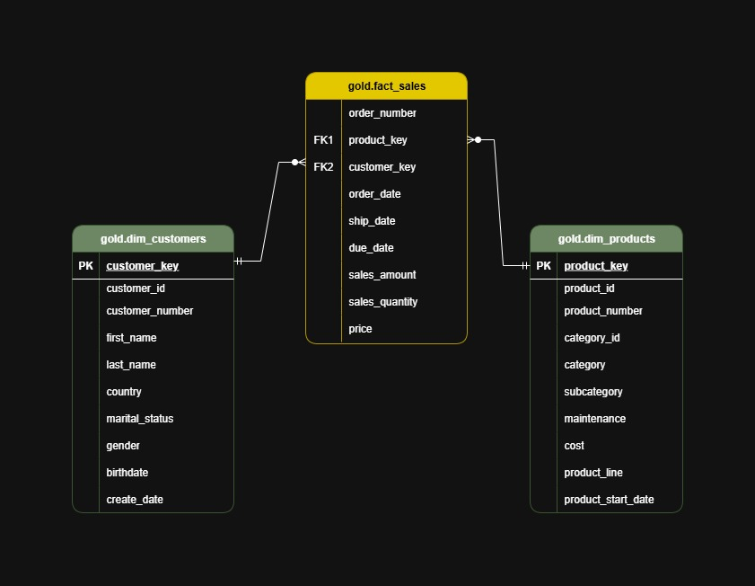

# Sales and Customer Data Warehouse - Medallion Architecture
This project builds a modern data warehouse using SQL Server and follows the medallion architecture. Data from CRM and ERP CSVs are ingested into the Bronze layer, cleaned and transformed in the Silver layer, and structured in Gold layer views for analytics and reporting.

